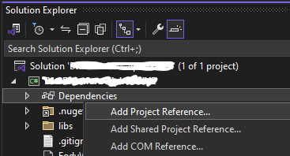

# GlobalHotKeyPort
.NET 8 Port from .NET Framework

## How to use in your project
 1. Clone or download this repository
 2. Open the .sln file visual studio
 3. Build the project and open the folder where it built to
 4. Then copy all the files from the builder folder.
 5. In your project make a 'lib' folder (or something similar) and paste all files from the build.
 6. Finally in your project click on dependencies -> Add Project Reference -> Browse -> Select the .dll -> press OK

  